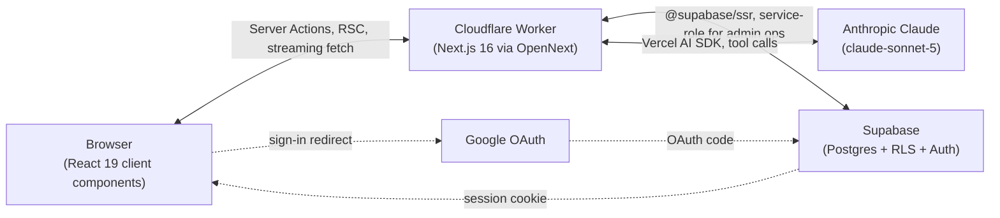

# Architecture

How WorkoutMate is actually built and deployed, in enough detail to work on it without reading every source file. See `CLAUDE.md` for the short version and the rules; see `docs/DATABASE.md`, `docs/AI_COACH.md`, and `docs/DEPLOYMENT.md` for depth on those three areas specifically.

## System overview



`proxy.ts` (Next 16's renamed `middleware.ts`) runs on every request at the Worker edge: it refreshes the Supabase session cookie and redirects unauthenticated requests away from protected routes.

## Authentication flow

1. `/login` → "Continue with Google" → Supabase's hosted OAuth redirect (`<project-ref>.supabase.co/auth/v1/callback`) → Google's consent screen → back to Supabase → back to the app's own `app/auth/callback/route.ts`.
2. That route exchanges the auth code for a session, then checks whether `profiles.onboarding_completed_at` is set: unset → `/onboarding`, set → `/dashboard`.
3. A Postgres trigger (`handle_new_user()`, migration `0002_profiles.sql`) auto-creates the `profiles` row the moment a new `auth.users` row appears — the app never has to.
4. `proxy.ts` gates every route under the authenticated shell; a missing/expired session redirects to `/login`.

## Onboarding flow

10-step wizard (`components/onboarding/`), state held client-side in a Zustand store seeded from `lib/validations/onboarding.ts`'s defaults so most steps are valid without the user touching anything. The final "Generate My Plan" step calls `completeOnboarding()` (`lib/actions/onboarding.ts`), a single Server Action that:

1. Validates the full payload with the same Zod schema client and server share.
2. Writes `profiles`, `fitness_goals`, `training_preferences`, `physical_limitations`.
3. Loads the active exercise pool and runs the deterministic generation engine (see below).
4. Persists the generated plan (`lib/generation/persist.ts`), which builds it as `status: 'draft'` and only flips it to `active` after every row succeeds — a failure midway never leaves a half-written plan live.
5. Redirects to `/dashboard`.

Nothing here is an LLM call. The Zod validation is the same "never save malformed output" boundary used for AI-proposed plan rebuilds too.

## Workout generation flow

`lib/generation/engine.ts` is pure, deterministic, unit-tested logic with no Supabase/network dependency:

1. **Split selection** (`split-templates.ts`) — resolves a template (full body / upper-lower / push-pull-legs / custom) from days-per-week and the user's stated preference.
2. **Schedule** (`schedule.ts`) — assigns training days to the user's preferred weekdays, fills the rest with explicit rest days (every weekday gets a `workout_days` row, `is_rest_day` true or false — there's no implicit "day with no row").
3. **Exercise selection** (`exercise-selection.ts`) — fills each day's slots from the exercise library, filtered by equipment, injuries/avoided exercises, and an experience-level ceiling that widens progressively (beginner → beginner+intermediate → all) only if a slot can't otherwise be filled, rather than jumping straight to "any difficulty."
4. **Prescription** (`prescription.ts`) — sets/reps/rest/intensity guidance from goal + training style + experience.

The AI coach can trigger this same engine (via `change_training_days` and `rebuild_plan`) but never generates plan structure itself — see `docs/AI_COACH.md`.

## Workout execution / logging flow

1. Dashboard shows a "Start Workout" CTA only for **today's** `workout_days` row (not any arbitrary day — `lib/actions/workout-session.ts#startWorkoutSession(workoutDayId)` will start a session for any day ID given one, but the UI only ever surfaces today's).
2. `/workout/[sessionId]` is a dedicated, chrome-free screen: one exercise at a time, weight/reps inputs per set, a rest timer (persisted as an absolute epoch timestamp in the Zustand store, so it survives a refresh), "Complete set," "Next Exercise," and "Finish Workout" on the last one.
3. Finishing writes the `workout_sessions` row and all `set_logs`, then runs PR detection (`lib/progress/pr-detection.ts`, backed by pure logic in `pr-logic.ts` so it's unit-testable without a DB) against the newly logged sets.
4. Dashboard and `/progress` both re-derive weekly completion, streaks, and PRs from real rows — nothing here is cached or estimated.

## AI Coach request flow

See `docs/AI_COACH.md` for full depth. In short: `app/api/coach/route.ts` authenticates the request, checks the caller against a per-user Cloudflare Rate Limiting binding (`lib/ai/rate-limit.ts` — rejects with `429` before any other work if exceeded), persists the incoming user message, builds a condensed context block (`lib/ai/context.ts` — not a full DB dump), builds the tool set (`lib/ai/tools.ts`), and streams a Claude response via the Vercel AI SDK, persisting the assistant's reply (and any tool calls) when the stream ends.

## AI tool execution flow

Every tool the model can call falls into one of two categories, enforced by where its `execute` function writes:

- **Read/log tools** query Supabase directly (still RLS-scoped, still Zod-validated inputs) and return data to the model immediately.
- **Plan-editing tools** never touch `workout_plans`/`workout_days`/`workout_exercises`. They call `proposeChange()` (`lib/ai/pending-change.ts`), which only inserts a row into `pending_plan_changes`. The chat UI (`components/coach/confirmation-card.tsx`) renders that row as an Apply/Cancel card. Clicking Apply calls `applyPendingChange()` (`lib/actions/coach.ts`) — a Server Action, not something the model can invoke — which re-validates ownership, switches on `change_type`, and only then writes to the real plan tables.

## Database architecture

Summarized here; full table-by-table detail in `docs/DATABASE.md`. 19 tables, all RLS-scoped to the owning `profile_id` except the shared, public-read exercise library. `profile_id` is denormalized onto child tables (`workout_days`, `workout_exercises`, etc.) via triggers so RLS stays a flat equality check rather than a multi-table join on every row.

## Security boundaries

| Boundary | Enforced by |
|---|---|
| User A can't read/write User B's data | Postgres RLS, scoped to `auth.uid()` — live-tested with two real authenticated accounts across every user-owned table (select/update/delete, both directions), not just inspected (see `docs/DATABASE.md`) |
| Browser never sees `SUPABASE_SERVICE_ROLE_KEY` / `ANTHROPIC_API_KEY` | Both are non-`NEXT_PUBLIC_` env vars, read only in server-only files; the production build fails if one leaks into a client bundle |
| AI can't mutate the plan directly | Plan-editing tools can only insert a `pending_plan_changes` row; `applyPendingChange()` is the sole write path, gated on the user's own click |
| AI tool inputs can't be malformed | Every tool has a Zod `inputSchema`, enforced by the AI SDK before `execute` runs |
| `/api/coach` can't be hammered for unbounded Anthropic spend | Per-user Cloudflare Rate Limiting binding (`COACH_RATE_LIMITER`, 20 req/60s), checked server-side before any model call — see `docs/AI_COACH.md` |
| Secrets don't reach source control | `.gitignore` covers `.env.local`/`.dev.vars`; `.claude/settings.json` also denies the `Read` tool on both as a backstop |

## Deployment architecture

Production is **Cloudflare Workers**, built via the OpenNext adapter — not Vercel, not Cloudflare's beta `vinext`. Full walkthrough, the exact build/deploy commands, and a real Windows-specific bug (and its fix) are in `docs/DEPLOYMENT.md`.

## Data flow summary

```
Browser action → Server Action or Route Handler (runs on the Worker)
  → @supabase/ssr client, scoped to the caller's session → Postgres (RLS enforced)
  → response streamed/returned to the Browser → UI re-renders from real data
```

The AI coach path is the only branch: a chat message additionally goes to Claude (with tool-calling), and any resulting plan edit is staged in `pending_plan_changes` rather than written directly, rejoining the same Server Action write path only once the user confirms.
